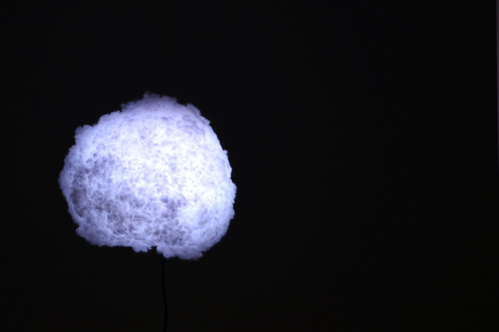

# Mini Wolke
`Mini Wolke` is a small lamp in shape of a cloud consisting of a lampion and cotton wool. Inside, it contains an Arduino with a RGB LED ring to light up the lamp.

## Build your own lamp
Read the [wiki](http://github.com/philenius/MiniWolke/wiki) for detailed instructions.
